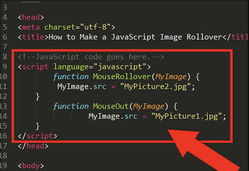

# Lightning

Lightning Exercise 1: Given two options of data structures - array or object - which should you use? You need to represent a red 2015 Ford Mustang in your code.

Lightning Exercise 2: Given two options of data structures - array or object - which should you use? You need to store list of animal names in a shelter. The names are "Kippers", "Jack", "Gypsy", "Angus", "Seymour Bouts", and "Sharky".

```
const animals = {
    currentAnimals: {
        first: ["Kippers", "Jack", "Gypsy", "Angus", "Seymour Bouts", "Sharky"]

    }
    ```

Lightning Exercise 3: Define an object for four family members, and put each object in an array named familyMembers. Each family member object that you create should have the same keys on them, but the values will be different.

            


## Installation
In your terminal run git clone SSH KEY HERE

cd into the project directory

From the main directory, run npm install to install dependencies

npm start


## Usage

1). Copy website url to navigate on to Website.
2). Scroll through navigation bar to look at different pages.
3). Click X to exit the webpage.